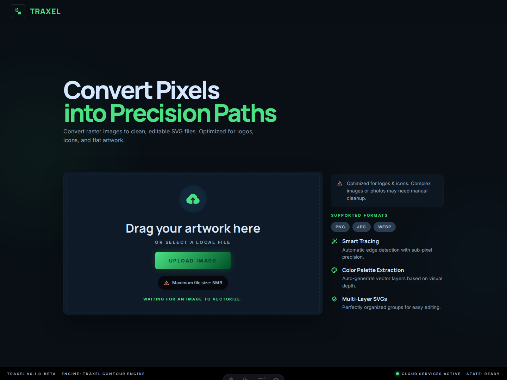
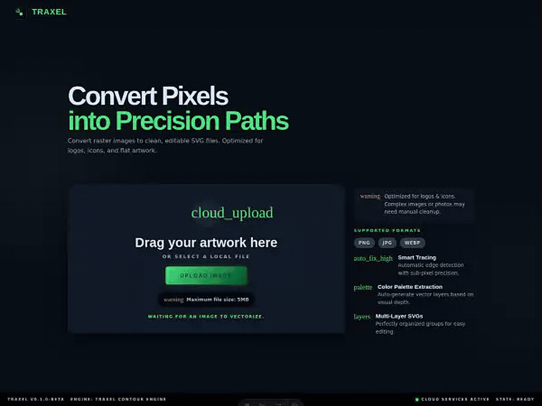
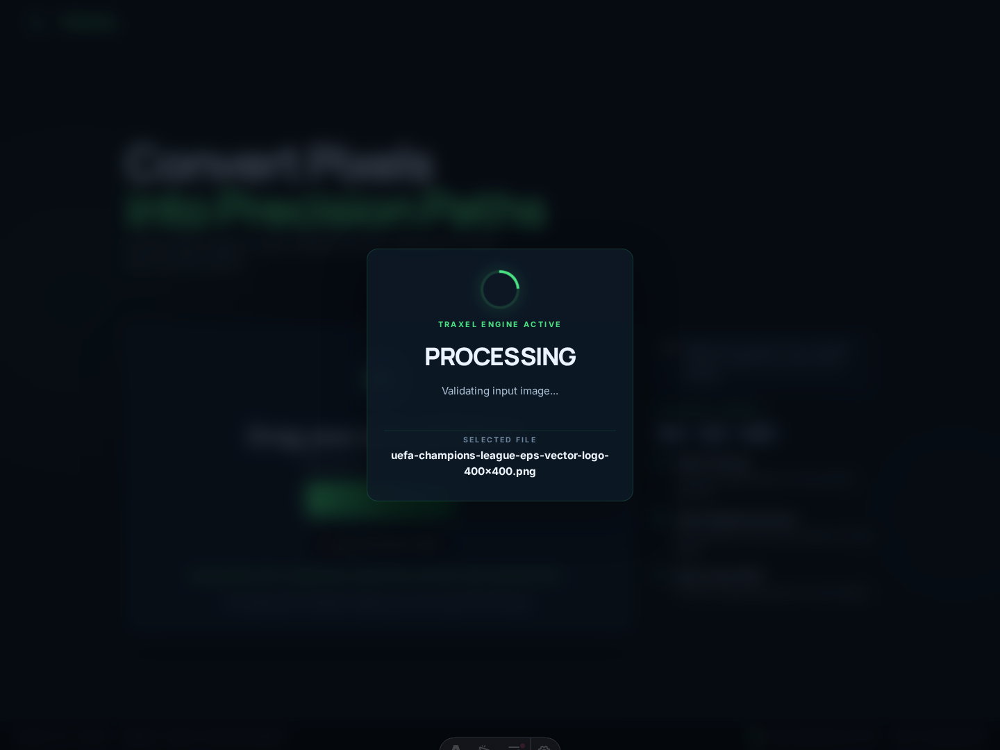
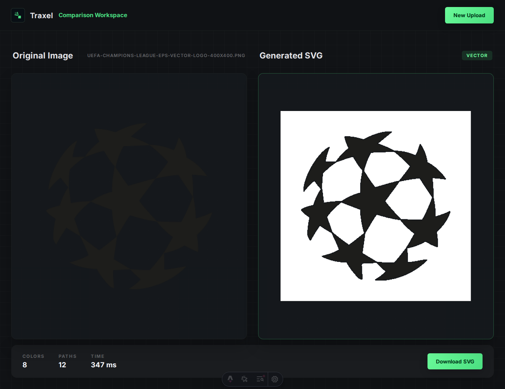
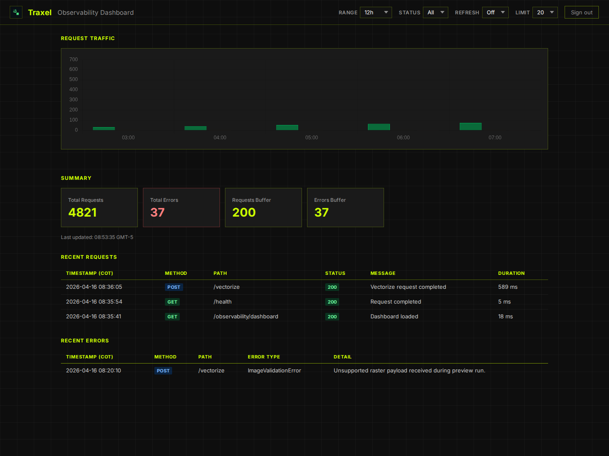

# Traxel

**Traxel** is where **traces** meet **pixels** — an open-source app that turns raster images into clean, editable SVG files.

Built for logos, icons, badges, and flat artwork, Traxel gives you a simple visual workflow: upload an image, let the engine process it, compare the result, and export a ready-to-edit SVG.



## Why Traxel

- **Pixels in, vectors out** — convert PNG, JPG, or WEBP files into SVG.
- **Visual comparison workspace** — compare the original image against the generated result.
- **Fast export loop** — upload, process, review, and download in one flow.
- **Observability dashboard** — keep an eye on traffic, request health, and recent errors.

## See it in action

Traxel is meant to feel visual, not intimidating. The flow below shows the product from landing screen to processing overlay to final comparison workspace.



## How it works

1. **Upload** a raster image from the main screen.
2. **Process** it with the Traxel vectorization engine.
3. **Compare** the original image and generated SVG in the workspace.
4. **Download** the final SVG for editing or delivery.

## Why it is useful

Traxel is especially helpful when you want to:

- clean up a logo before redesigning it,
- turn a badge or icon into an editable vector,
- inspect the generated result side by side before exporting,
- keep the workflow lightweight during prototyping.

## Product views

**Processing state**



**Workspace comparison**



**Observability dashboard**



## Open source workflow

Traxel is currently structured as a lightweight full-stack app:

- **Frontend:** Astro
- **Backend:** FastAPI / Uvicorn
- **E2E automation:** Playwright
- **Local orchestration:** Docker Compose

## Getting started locally

### Requirements

- Docker
- Docker Compose v2 (`docker compose`)

### Run the full app

From the repo root:

```bash
docker compose up --build
```

Exposed services:

- frontend: `http://localhost:4321`
- backend: `http://localhost:8000`
- backend health: `http://localhost:8000/health`

To stop everything:

```bash
docker compose down
```

## Useful environment variables

The `compose.yml` file exposes these overrides:

- `PUBLIC_BACKEND_ENDPOINT`
- `LOG_LEVEL`
- `DEPLOYMENT_ENVIRONMENT`

Example:

```bash
PUBLIC_BACKEND_ENDPOINT=http://localhost:8000 docker compose up --build
```

## Basic Docker commands

See resolved config:

```bash
docker compose config
```

See logs:

```bash
docker compose logs -f backend
docker compose logs -f frontend
```

Rebuild images:

```bash
docker compose build --no-cache
```

## Current tradeoffs

- The frontend runs in `astro dev` mode to keep the MVP simple and fast to iterate on.
- `PUBLIC_BACKEND_ENDPOINT` defaults to `http://localhost:8000`; the frontend derives `/vectorize` and `/obs/*` from that base because the browser performs the fetch, not the frontend container.
- The current MVP is centered on Docker Compose to reduce local environment drift.

## Contributing

If you want to improve Traxel, a good place to start is one of these:

- improve the vectorization quality for more complex artwork,
- refine the product UX and onboarding copy,
- tighten the README/demo assets for GitHub presentation,
- add broader test coverage around the vectorization workflow.
